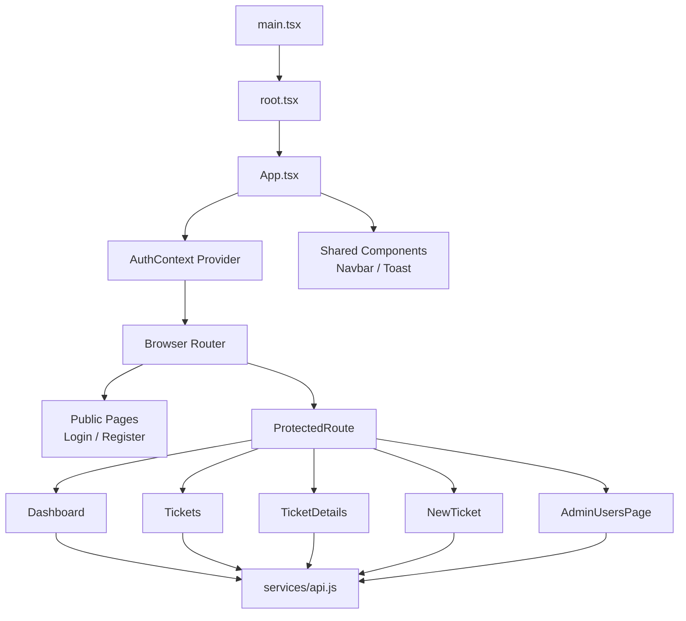

# Dvori HelpDesk SPA — Product-Grade Frontend


Professional ticket-management frontend built as a scalable, UX-first Single Page Application.

---

## The Vision

המערכת הזו אינה רק פרויקט תרגול, אלא מימוש נקי ומדויק של עקרונות **SPA (Single Page Application)** ברמת מוצר.
הדגש הוא על ארכיטקטורה מודולרית, חוויית משתמש אחידה, ויכולת התרחבות עתידית ללא פגיעה באיכות הקוד.

באמצעות חלוקה ברורה בין `pages`, `components`, `context` ו-`services`, הפרויקט מציג חשיבה הנדסית שמכוונת ל-UX/UI מצטיין ולתחזוקה ארוכת טווח.

---

## Core Intelligence

### State Management
ניהול מצב האפליקציה מבוסס `React Context` ו-`Hooks`, כדי לאפשר זרימת מידע עקבית, שליטה ב-Authentication, ושמירה על UI רספונסיבי ואמין.

### Dynamic Routing
שכבת הניווט נשענת על `React Router`, כולל `ProtectedRoute` למסלולים מאובטחים. כך מתקבל מעבר מהיר בין מסכים ללא רענון עמוד ובהתאם לעקרונות SPA.

### Component Reusability
המערכת נבנתה בגישת `Component Reusability` עם רכיבים משותפים כמו `Navbar` ו-`Toast`, לטובת אחידות עיצובית, קיצור זמני פיתוח, ושיפור תחזוקה.

---

## Architecture



---

## Tech Stack

| Layer | Tool | Role |
|---|---|---|
| UI Library | React 19 | Component-based SPA rendering |
| Build Tool | Vite 6 | Fast dev server and optimized builds |
| Routing | react-router-dom 7 | Client-side navigation and route protection |
| State | React Context + Hooks | Shared state and logic composition |
| HTTP | Axios | API communication layer |
| UI Framework | MUI + Emotion | Modern, consistent UI system |
| Styling | CSS3 | Responsive and maintainable styling |

---

## Clean Setup

### 1) Install
```bash
npm install
```

### 2) Run (development)
```bash
npm run dev
```

### 3) Build (production)
```bash
npm run build
```

---

## Product & Engineering Standard

הפרויקט פותח בגישה מוצרית: הפרדת אחריות, קריאות גבוהה, ויכולת סקייל.
המטרה היא לא רק אפליקציה עובדת, אלא חוויית UX/UI איכותית עם סטנדרט הנדסי גבוה.