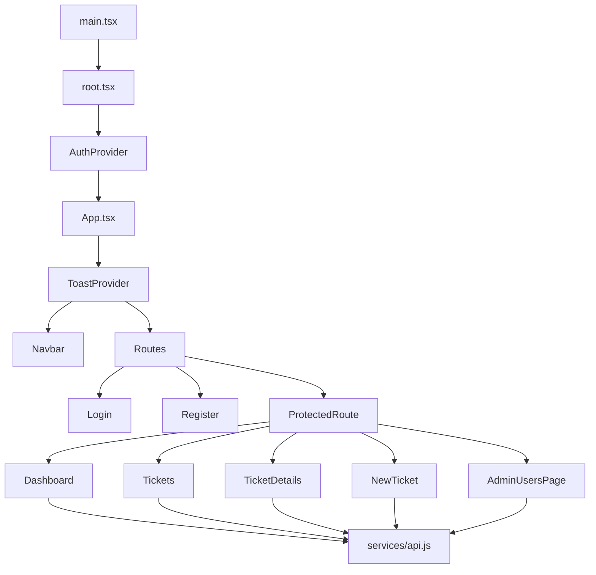
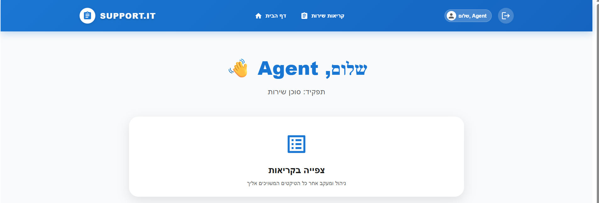
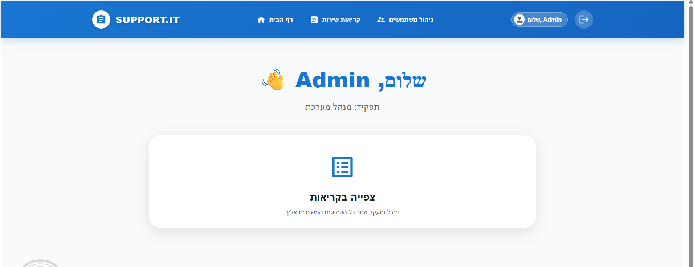
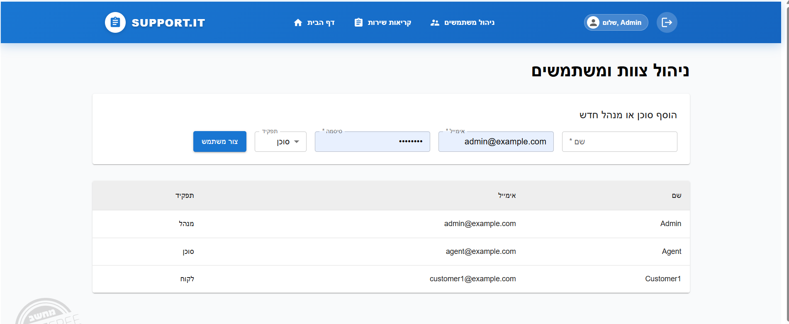
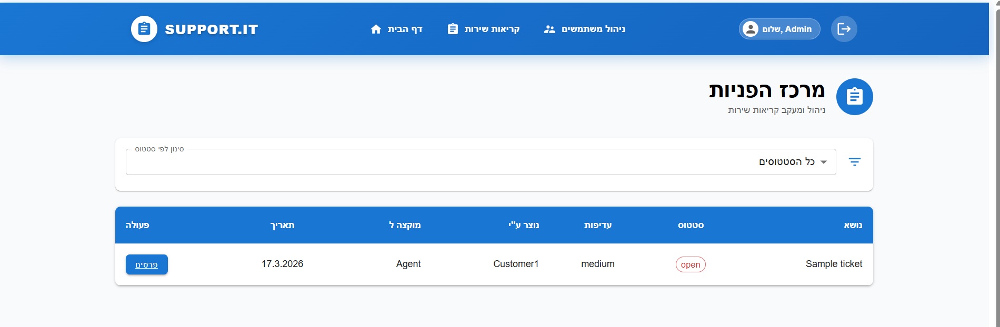

# Dvori HelpDesk SPA — High-End Engineering Frontend


Production-oriented SPA frontend for service-ticket operations, designed with an engineering mindset, modular architecture, and premium UX/UI standards.

---

## Product Vision

This product is built for scalability, reliability, and user clarity: a clean Single Page Application architecture that keeps interfaces fast, interactions intuitive, and feature delivery maintainable as the system grows across users, roles, and operational complexity.

---

## Architecture



---

## Tech Stack

| Domain | Technology | Engineering Value |
|---|---|---|
| UI Runtime | React 19 | Declarative component model for complex SPA flows |
| Build Platform | Vite 6 | Fast local feedback loop and optimized production bundles |
| Routing Layer | react-router-dom 7 | Dynamic client routing with guarded access paths |
| State Layer | Context API + Hooks | Controlled shared state and predictable UI behavior |
| Network Layer | Axios | Centralized and testable API communication |
| Design System | MUI + Emotion | Consistent UI primitives and scalable styling |
| Styling | CSS3 | Responsive layout and maintainable visual polish |

---

## Showcase — 2x2 Product Grid

<table align="center">
  <tr>
    <td align="center">
      
      <br />
      <strong>Dashboard</strong>
      <br />
      <em>High-level UI visibility and operational clarity</em>
    </td>
    <td align="center">
      
      <br />
      <strong>Admin User Management</strong>
      <br />
      <em>High-level UI governance for user-role administration</em>
    </td>
  </tr>
  <tr>
    <td align="center">
      
      <br />
      <strong>Tickets List</strong>
      <br />
      <em>Deep feature logic with SPA performance and efficient filtering</em>
    </td>
    <td align="center">
      
      <br />
      <strong>Detailed Ticket View + Comments</strong>
      <br />
      <em>Deep feature logic: custom commenting and status-tracking lifecycle</em>
    </td>
  </tr>
</table>

### Challenge & Solution Highlights

- **Dashboard — Challenge**: Keep role-aware summary data consistent across route transitions.
	**Solution**: Centralize user/session data with `Context API` + `Hooks` for deterministic state updates.

- **Admin User Management — Challenge**: Maintain secure, intuitive control for privileged actions.
	**Solution**: Apply guarded navigation with `ProtectedRoute` and role-based behavior for governance.

- **Tickets List — Challenge**: Preserve fluid UX while searching and filtering ticket collections.
	**Solution**: Use focused React state updates and efficient client-side filtering to minimize unnecessary re-renders in SPA flows.

- **Detailed Ticket View with Comments — Challenge**: Support collaborative updates while tracking ticket state transitions.
	**Solution**: Implement a custom commenting system and status-tracking logic using React state and backend integration to keep history, communication, and lifecycle state synchronized.

---

## Local Setup

```bash
npm install
npm run dev
```

For production build:

```bash
npm run build
```